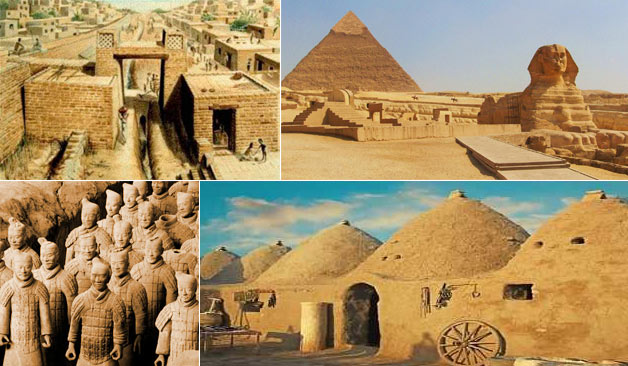
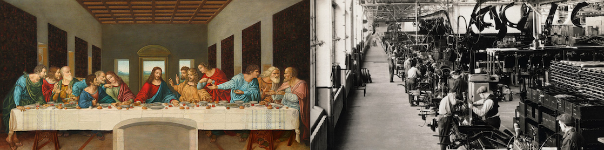
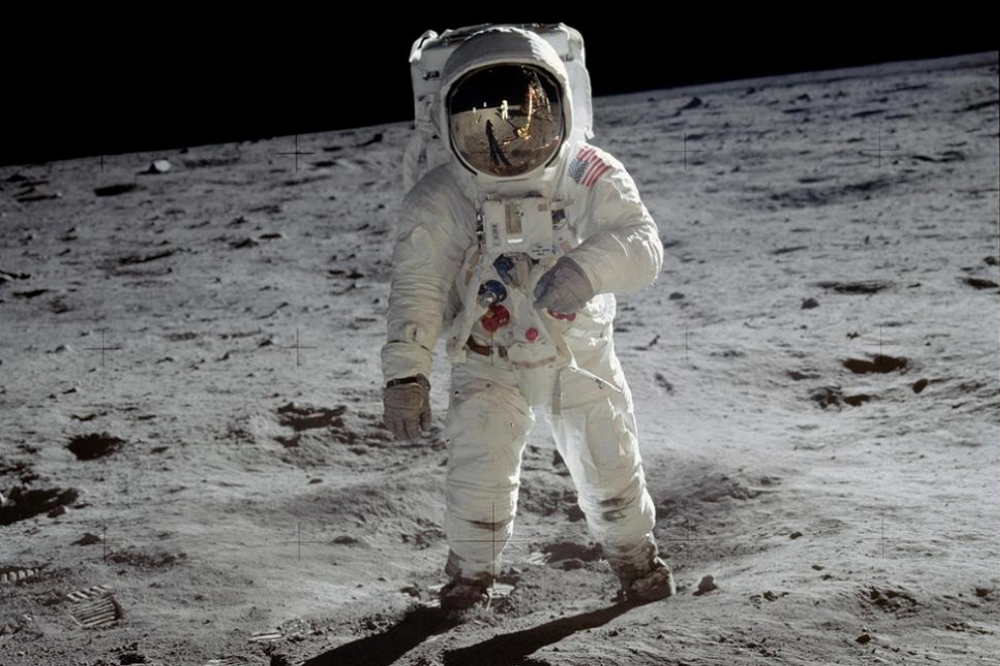
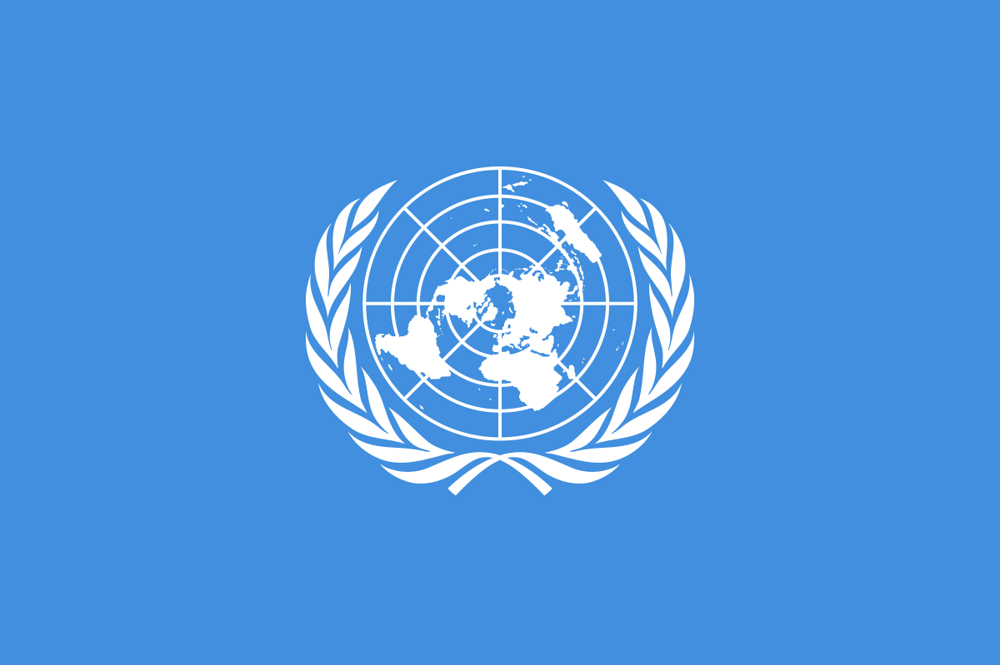

# 01.我们经历了什么

简单的历史框架

## 远古之前

宇宙诞生于约 137亿 年前，银河系诞生于约 136亿 年前，太阳系\(地球\)诞生于约 46亿 年前

人类产生于约 1500万 年前，人类文明诞生于约 260万 年前\(石器时代\)

深度参考: [人类演化历史](https://zh.wikipedia.org/wiki/人类演化历程)

## **上古**

* 公元前30世纪以前: 古埃及，中国
* 公元前30世纪~公元元年: 古印度，古巴比伦

## **中古**

* 公元前10世纪~公元元年: 古希腊，犹太文明
* 公元1世纪~公元5世纪: 古罗马\(西\)
* 公元5世纪~公元15世纪: 古罗马\(东\)，阿拉伯帝国，中世纪

## **近代**

* 公元16~19世纪: 地理大发现，文艺复兴，启蒙运动，法国大革命，英国工业革命，资本主义产生，列强崛起

## **现代**

* 公元20世纪至今: 第一二次世界大战，冷战，登月，联合国与WTO

