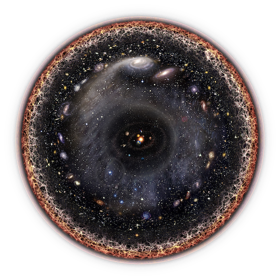
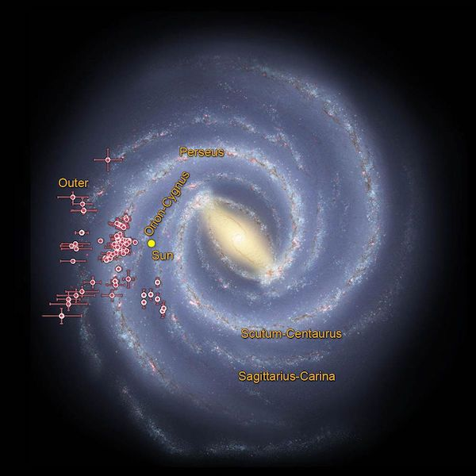
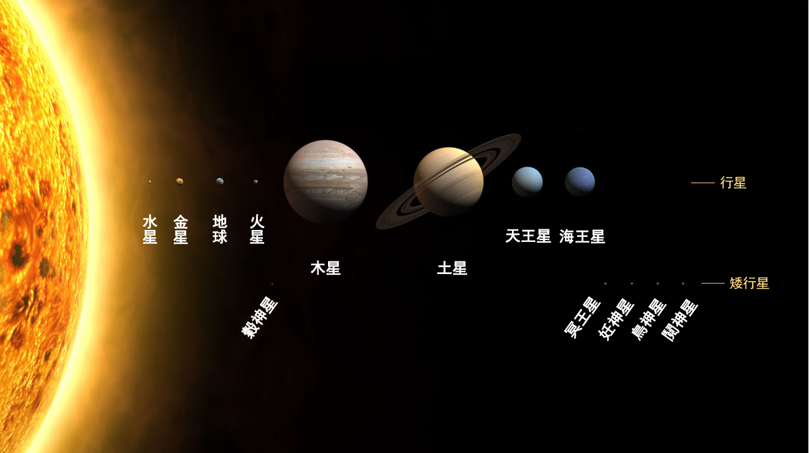
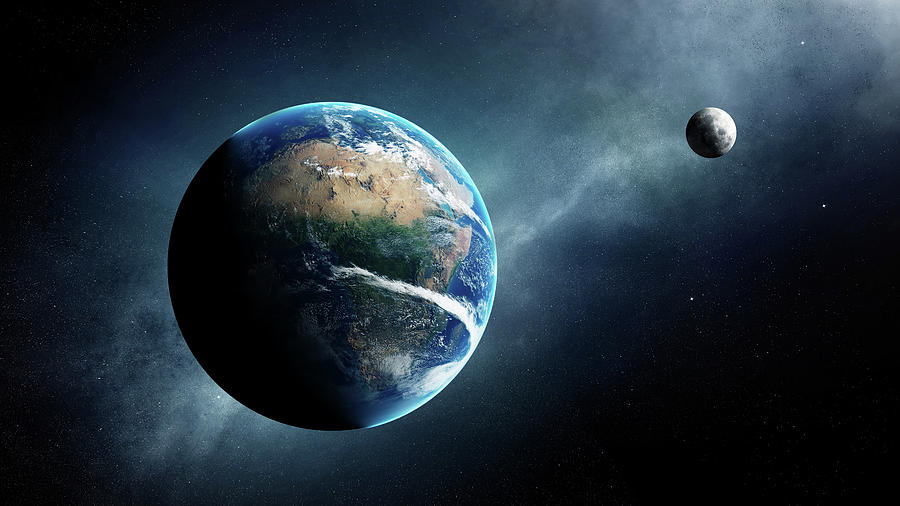
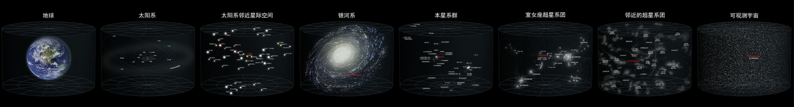

# 01.我们在哪里

简单的天文知识

不久以前，我们人类就像婴儿一样，从蒙昧中醒来，开始仰望天空思考我们在哪里。随着科学的发展，我们能够看到的东西越来越多，也看得越来越远，我们对我们在哪里有了一个模糊的概念，我们生活在宇宙中的一个叫银河系的星系，里面的一个叫太阳系的恒星系统中第三颗蓝色的行星上，我们叫它地球，就是我们口中的世界。下面展示的图像，只是我们根据我们能看到的宇宙的有限的部分所推测出来的样子，我们对宇宙的认识会不断更新和深入。

## 宇宙 

宇宙诞生于约 137亿 年前

## 银河系 

银河系诞生于约 136亿 年前

是一个包含 [太阳系](https://zh.wikipedia.org/wiki/太陽系) 的 [棒旋星系](https://zh.wikipedia.org/wiki/棒旋星系)。

直径介于100,000 [光年](https://zh.wikipedia.org/wiki/光年) 至180,000光年。估计拥有1,000亿至4,000亿颗 [恒星](https://zh.wikipedia.org/wiki/恆星)，并可能有1,000亿颗 [行星](https://zh.wikipedia.org/wiki/行星)。

外面的引力会影响星系棒，在银河系盘面的恒星和星际介质结构是4条螺旋臂

* 人马座旋臂
* 猎户座旋臂 \[太阳系所在\]
* 英仙座旋臂
* 3000秒差距臂

## 太阳系 

太阳系\(地球\)诞生于约 46亿 年前

太阳系距离 [银河中心](https://zh.wikipedia.org/wiki/銀心) 约26,000光年，在有着浓密气体和尘埃，被称为 **猎户座－天鹅座旋臂**\(_Orion_-_Cygnus Arm_\) 的内侧边缘

## 地月系统 

**地月系**是一个由 [地球](https://zh.wikipedia.org/wiki/地球) 和 [月球](https://zh.wikipedia.org/wiki/月球) 组成的 [天体系统](https://zh.wikipedia.org/w/index.php?title=天体系统&action=edit&redlink=1)，地球乃地月系之中心 [天体](https://zh.wikipedia.org/wiki/天体列表)。月球乃地球之唯一天然 [卫星](https://zh.wikipedia.org/wiki/卫星)，也是距离地球最近的自然天体。地月平均距离为38.4万千米。

## 地球在宇宙中的位置 

[查看大图](https://zh.wikipedia.org/wiki/地球在宇宙中的位置#/media/File:地球在宇宙中的位置.jpeg) \| [深入阅读](https://zh.wikipedia.org/wiki/地球在宇宙中的位置)

