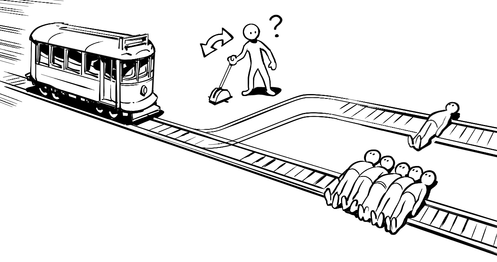

# 02.\[对与错\] 什么是对的什么是错的

价值观与道德

逻辑层面的对与错是客观的，但在道德与价值观层面，不存在绝对的对与错

逻辑反映的是这个世界的规则，即我们通过观察这个世界的运行方式总结出来的规律，比如总是先有因才有果，只有条件充分了结果才会产生等等；

## 道德与价值观

我们对事物和行业的对错判断，来源于我们的道德观念和价值观，道德观念与价值观是一群人通过长期实践所得出的一系列共识，它们所反映的是这一群人对事物的看法，如果你愿意成为这群人的一部分，相信你也认同他们对事物的看法。

当我们看到的事物与我们的道德观念与价值观相违背了，我们会将其评判为错的，反之则评判为对的

* _如果我们相信公平正义应该得到实现，那对于霸凌行为就会认为是错的_
* _如果我们相信弱肉强食的丛林潜规则，那对于霸凌行为就会认为是对的_

## 如何选择

道德观念与价值观选择是个人行为，你可能受到不同人的影响，但没有人能帮你选择。

我们可以从历史中的经验，从当下不同群体的选择和他们的生活方式中，选择我们所认同的道德观念与价值观，然后用你发自内心选择的观念去评判对与错。

我们要捍卫我们所认同的道德与价值观念，但不要去过度评判甚至践踏别人的价值观观念，这一条是我自己的选择。

